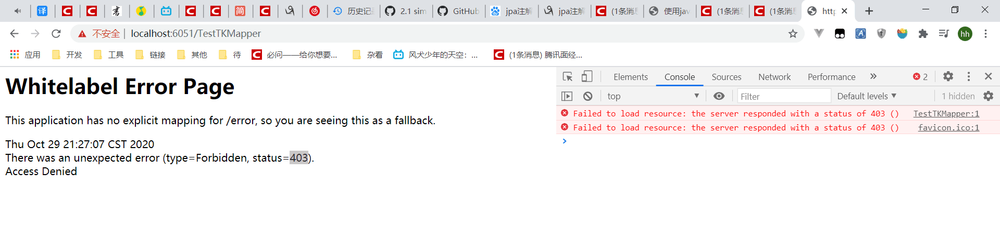

###  403 

>说明： 403应该是请求有到服务器，但被服务器拒绝了。（此时请求是还没到达目标接口的，所以是无法判断接口时候存在的） 
 * 场景1： 
   
    
	
	原因1：    
	```
	1.此处是因为接口未开放，且请求种未携带token导致被security拒绝
	```
    解决方案：
    ```
    方式1：请求携带token等认证信息。
    方式2：开放该接口，让其无需认证。
	```
	
 * 场景2：    
      ```
      
    ```
    原因2：    
     ```
    
     ```
    解决方案：
      ```
    
      ```
>附： 

- - -

###  ERR_INCOMPLETE_CHUNKED_ENCODING 
>
 * 场景1： 

    所有请求都不成功，控制台打印该异常代码
	
	原因1：    
	```
	1.此处是因为根目录磁盘空间满了，导致tomcat无地方写临时数据
	```
    解决方案：
    ```
    https://blog.csdn.net/bobo5582191/article/details/92806937
    方式1：清根目录磁盘空间
	```
	
>附： 

###  linux 环境下进程被 killed掉    

	原因1：    
	```
	https://lightsail.blog.csdn.net/article/details/80004315?utm_medium=distribute.pc_relevant_t0.none-task-blog-searchFromBaidu-1.control&depth_1-utm_source=distribute.pc_relevant_t0.none-task-blog-searchFromBaidu-1.control
	可能原因是
	(1)内存不够
	    查看linux 系统日志 vi /var/log/messages
	    如果日志中出现Out of memory: Kill process意味着整个系统的内存已经不足，如果不杀死进程的话，就会导致系统的崩溃.
	(2)程序出错
	查看应用日志等
	```
	解决方案：
	```
	```

>附： 
>
>1. /usr/sbin/rsyslogd 内存过大，也可限制下 https://blog.espnlol.com/?p=525
>
>2. 卸载腾讯云云服务器安全
>
>  ```
>  1. https://blog.csdn.net/zhangpeterx/article/details/89704532
>  2. https://zabbx.cn/archives/%E5%8D%B8%E8%BD%BD%E8%85%BE%E8%AE%AF%E4%BA%91%E6%9C%8D%E5%8A%A1%E5%99%A8%E5%AE%89%E5%85%A8%E7%9B%91%E6%8E%A7%E7%BB%84%E4%BB%B6
>  1. 一种是通过控制台卸载
>  2. 一种是命令卸载
>  ```
>

- - -
###  接口请求慢、耗时    

#### 问题定位

```
首先你要定位到问题所在：
	1.网络问题（访问到应用的过程问题）
		诊断方式：
			方式1：换终端换网段等进行快速测试
			方式2：tracert、ping等命令测试
	2.应用问题，
		追踪方向：
			1.应用并发量过大
				附：跟cpu有关，通常tomcat并发量200为佳。
				？
					请求过多会有什么影响了？为什么请求过多会导致接口变慢了？
					如何判断请求是否过多了？
						代码打印？
						druid等工具？那druid等工具是如何实现请求是否过多了？
					
			2.应用性能（服务器cpu，内存，io，进程等）
				附：看代码逻辑中是否有大I/O,高强度计算，大并发
				？
					cpu过高会有什么影响了？为什么cpu过高会导致请求过慢？
					内存同问？
					io同问？
			...
	3.数据库问题。
		追踪方向：
			一般请求慢都是大量慢sql堆积会导致cpu飙升，可通过以下三种方式跟踪。
			1. 监控服务器性能：
				使用top等命令监控数据库那台linux服务器性能。（cpu，内存，平均负载，进程占用资源情况...）
				附：
				使用该方式来可以快速确认是否是数据库问题，因为如果大量慢sql堆积会导致cpu飙升。
			2. 通过
				1. druid
					能判断出那个请求慢，那个sql慢
				或2.mysql慢查询
					能判断出有那些慢sql 且带参数的，就能判断是那个sql有问题。
			
			方式3. 查看数据库线程情况： 
				https://www.cnblogs.com/duhuo/p/5678286.html
				通过 show processlist 来判断数据库性能，连接数，慢sql堆积，网络状况等各种情况...
				附：
					https://www.cnblogs.com/remember-forget/p/10400496.html
					https://blog.csdn.net/dhfzhishi/article/details/81263084
					https://www.cnblogs.com/hixiaowei/p/10934484.html
			附： 
				1. 并发模拟，或发生问题时现场诊断。并发模拟工具：https://github.com/yuyumyself/UtilsProject/blob/master/Utils/src/main/java/com/china/hcg/thread/ThreadPoolUtilsDemo.java
				2. 连接数是否充足，不够的话数据库服务器性能不高，但会导致应用请求一直等。
				3.Navicat Monitor等监控工具。		
		附：
			锁等待是会某些导致请求发起不成功，如无法修改某个记录(行锁)、无法新增（表锁）、
				/事务/锁等待.txt


					
		解决方案：
			先找出导致问题的sql语句，例有问题的时间段有那些慢sql等。
			1.走缓存
				附：缓存部分清空。失效后能否在业务低峰期在重新加载Redis缓存。
			2.优化代码逻辑，根据所需数据，看看能否少掉这个sql或少掉部分sql。
			3.sql优化：
				1. 通过explain优化sql，尽量全部走索引。
				2. 少关联表，不要超过3个表的多表关联。
					关联越多，影响因素越多，且数据量是递增级别。
				3. 复杂sql拆分成多个SQL查询。
					这样可以避免语句相互之间影响。
					让语句简洁易懂，好维护才是王道。
				4. 通过程序把查询结果带入，通过程序合并sql结果，让程序来负担一部分数据库压力。		
附：
	druid：
		druid是一个JDBC组件，它包含了数据库连接池和数据库访问性能监控等。
		在监控页面中我们可以看到：请求耗时（一个请求到应用后面的耗时），sql耗时等。
		监控页面：
			http://ip:端口/druid/ 
	如何诊断页面为何加载慢：
		统计打开页面耗时：
			如果页面打开慢，那么就看下打开这个页面要那些请求，然后看下这些请求的发起与加载时间，然后统计最终要加载的耗时。
		统计方式：	
			可在谷歌的network那条时间轴上滑动来快速的确认请求的发起顺序和时间。
			例：
				阅办单的载是跟这三个请求有关，根据各种手段分辨出 1完-2完（1结束开才始）-3完（2结束开才始），最终3个请求加起来计算出页面耗时。
```


>案例1
```
例：
某请求慢，通过跟踪发现，应用服务器cpu较高。
通过top命令找出高消耗进程，和进程的高消耗线程。
jstack命令把jvm内存信息导出，然后进行分析。
...

```

>案例2

```
例1接口大并发时慢：
	1. 网络是没问题的
	2. 应用也是没有问题的，因为top命令应用服务器性能稳定。
		且代码逻辑中没有什么大io操作，或计算等耗时操作等
	3. 那么问题应该就是数据库层面问题。
	思路：
		优先看数据库性能，因为诊断较快。
		druid清空，开启慢sql，然后并发模拟。
		发现数据库性能消耗是较高，且druid（判断那个类型sql慢）和慢sql（具体是那个sql慢，有参数的）中均发现大量耗时sql。（这种情况实际环境中更为明显）
		因为均为查询接口，所以无需关心锁的问题，那么此时就尽量进行查询sql优化来进行初步调整。结果并发模拟和实际是得到了不错结果。
		如果未得到较好结果在尝试缓存，代码逻辑优化，集群等方案，因为问题总得解决如果不解决直接上这些方案，只是进行了问题掩盖，雷还是在的。
	附：
		1. 为什么只是查询sql无需关心锁问题：
			因为只是查询，那么也只会加共享锁才对，而共享锁下查询可以并发。
			附：
				要查询的数据，被别的给加了排他锁。
				如果是这种情况，那么就要整个应用查找哪里会有更新语句，然后尽量缩小其锁定范围。
		2. 大量慢SQL堆积导致CPU资源打满，整体数据库的性能下降。
			当未走索引或多表关联等进行大量查询时，此时数据库会调用cpu资源在硬盘中进行大量的io操作和查询，这是很耗费系统资源的。
	附（废弃）：
		接口的核心sql语句单独执行发现并没有很慢，那么此时可得到什么结论了：
			嗯，核心接口表并没有被锁。但数据库性能不够并不能完全排除
例2：
	https://blog.csdn.net/weixin_41715077/article/details/102607330

```
- - -

### Connection reset by peer

>
 * 场景1： 

    https://blog.csdn.net/candyguy242/article/details/25699727
	
	https://www.cnblogs.com/lilinwei340/p/13021864.html
	
	原因1：    
	
    ```
    
    ```
    解决方案：
	```
	
	```
	
>附： 
>

 * 场景2： 

    idea自动生成的axis代码访问webservice服务，开始连的好好的，但是后面突然有一天报Connection reset。
	
	原因1：    
	
	```
	当时应用没更新，所以判断1. 要么webservice服务器 问题 2. 要么中间网关问题
    通过ping、postman、代码http模拟请求等都无问题，判断应该是axis代码http请求问题导致被网关拦截
    ```
    解决方案：
    ```
	代码http模拟是1.1 ，所以尝试 axis代码http协议升级1.1 可以
	```
	
>附： 
>
>Connection reset
>
>https://blog.csdn.net/qq_44866828/article/details/126590435
>
>https://zhuanlan.zhihu.com/p/511538753